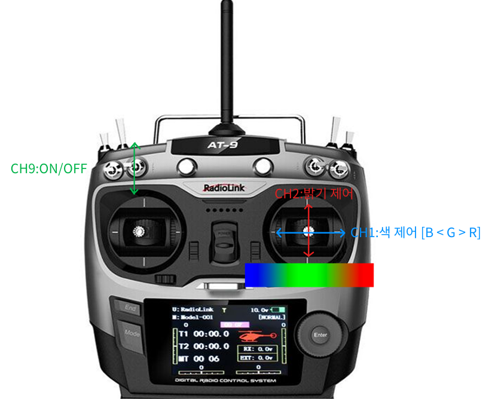
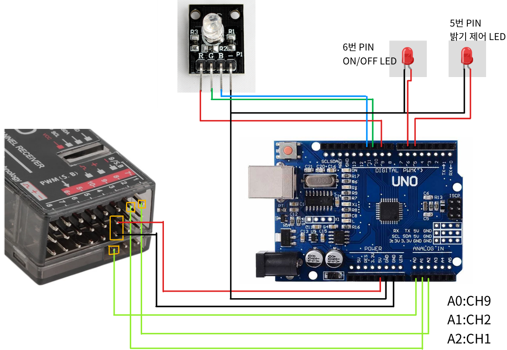

# ECS_RCcar_Project

## YOUTUBE 시연 영상 [HERE](https://www.youtube.com/watch?v=YIxO3vaZvms&ab_channel=%EA%B9%80%EC%88%98%EB%AF%BC)

## 과제 개요
- RC 송수신기로부터 들어오는 PWM 신호를 활용하여 LED를 제어하는 시스템을 구현합니다.

## 조작 채널 및 기능

| 채널  | 조작                                    | 기능                             |
| ----- | --------------------------------------- | -------------------------------- |
| CH9   | 좌측 상단 두 번째 토글                       | LED 켜기/끄기                    |
| CH2   | 오른쪽 스틱 상/하                       | 밝기 조절 (255–0)                |
| CH1   | 오른쪽 스틱 (좌 ← 중앙 → 우)           | 색상 선택 (파랑 ← 초록 → 빨강강)   |

## 구현 단계별 개요

| 단계 | 기능              | 세부 설명                                                               |
| ---- | ----------------- | ----------------------------------------------------------------------- |
| 1    | PWM 신호 감지     | A0/A1/A2 입력 핀에 attachPCINT를 사용하여 HIGH 펄스 길이 측정 (micros()) |
| 2    | On/Off 제어 (CH9) | 펄스 폭 > 1800μs → LED On, ≤ 1800μs → LED Off                            |
| 3    | 밝기 조절 (CH2)   | map(nRC2PulseWidth, PWM_MIN, PWM_MAX, 0, 255)으로 비율 계산              |
| 4    | 색상 선택 (CH1)   | 펄스 폭 범위별로 R/G/B 밝기를 map()으로 조절                             |
| 5    | PWM 출력          | analogWrite()로 D6/D5/D9/D10/D11에 각각 신호 전송                       |

## 배선 연결

| 구분 | Arduino 핀   | 연결 대상                             |
| ---- | ------------ | ------------------------------------- |
| 전원 | 5V           | 수신기 VCC                            |
| 접지 | GND          | 수신기 GND, LED 모듈 GND              |

| RC 수신기 채널    | Arduino 아날로그 핀       | 용도              |
| ----------------- | ------------------------ | ----------------- |
| CH9 → ON/OFF      | A0 (pinRC9_ONOFF)        | LED 켜기/끄기     |
| CH2 → 밝기        | A1 (pinRC2_Brightness)   | 밝기 조절         |
| CH1 → 색상        | A2 (pinRC1_Color)        | 색상 선택         |

| LED 제어 핀            | Arduino 디지털 핀       | 기능                |
| ---------------------- | ---------------------- | ------------------- |
| ON/OFF                 | D6  (ONOFF_PIN)        | LED On/Off 제어     |
| Brightness             | D5  (Brightness_PIN)   | 전체 밝기 조절      |
| Red channel            | D9  (COLOR_RED_PIN)    | Red LED 밝기 제어   |
| Green channel          | D10 (COLOR_GREEN_PIN)  | Green LED 밝기 제어 |
| Blue channel           | D11 (COLOR_BLUE_PIN)   | Blue LED 밝기 제어  |

## 실제 측정 PWM 범위

- 참고: 실제 측정된 PWM 값은 사용자 기기나 환경, 개인별 설정에 따라 차이가 있을 수 있습니다.

| 매개변수    | 값    |
| ----------- | -----|
| **PWM_MIN** | 1068  |
| **PWM_MAX** | 1932  |
